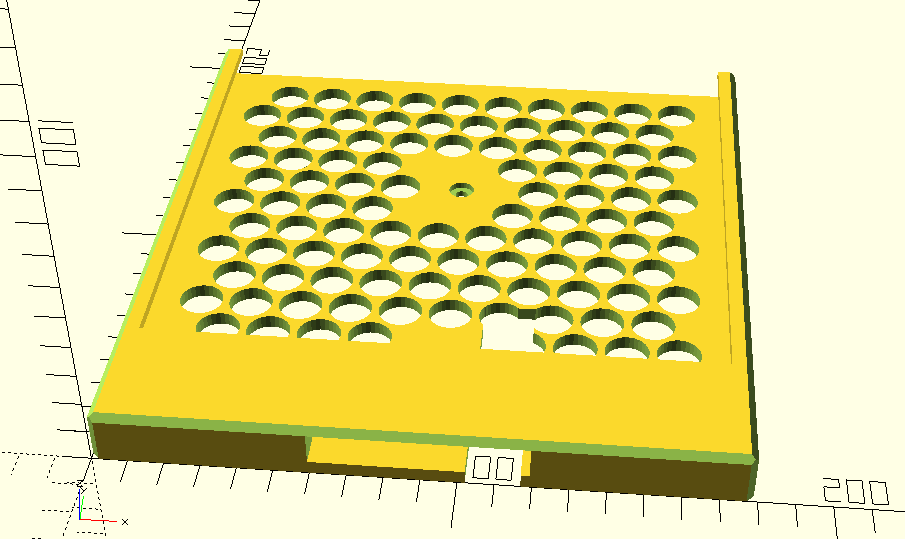

# Tablet Wall Mount for Electrical Box

## Introduction

I wanted to be able to mount a tablet to a wall, with two main
requirements:

1. Easily removeable without leaving any wall repairs to be done, when
    I chose to remove it.
1. Convenient management for powering the tablet and avoiding visible
    wires.

This design works off the idea that you can have power in an electrical
box in the wall, then screw this holder to the standard fittings on the
electrical box. If/when you want rid of it, just take it off and replace
it with a blanking plate, or a cover plate that makes the electricity
otherwise available.

There's a slot for a power cable, and the bottom is broad enough to hide
the connector where it meets the tablet.

Since I already have PoE in my house, I ran PoE to the electrical box
then had a PoE-to-tablet-connector converter.

## This is what it looks like



## Making it work for you

The SCAD file has lots of parameters at the top. The most important are
```tablet_width```, ```tablet_height```, and ```tablet_depth```
to fit whatever tablet you have.

Gary <chunkyks@gmail.com>
